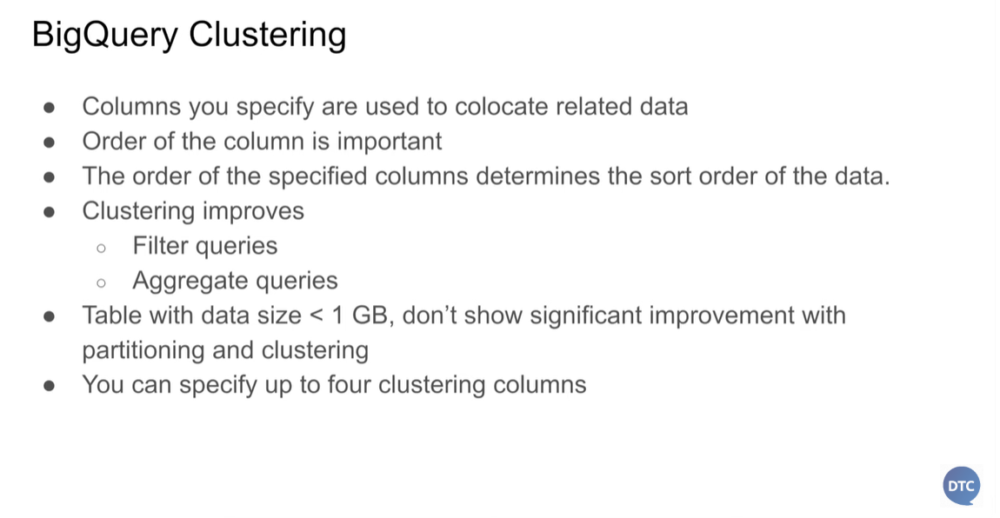

## Module 3 Homework

ATTENTION: At the end of the submission form, you will be required to include a link to your GitHub repository or other public code-hosting site. 
This repository should contain your code for solving the homework. If your solution includes code that is not in file format (such as SQL queries or 
shell commands), please include these directly in the README file of your repository.

<b><u>Important Note:</b></u> <p> For this homework we will be using the Yellow Taxi Trip Records for **January 2024 - June 2024 NOT the entire year of data** 
Parquet Files from the New York
City Taxi Data found here: </br> https://www.nyc.gov/site/tlc/about/tlc-trip-record-data.page </br>
If you are using orchestration such as Kestra, Mage, Airflow or Prefect etc. do not load the data into Big Query using the orchestrator.</br> 
Stop with loading the files into a bucket. </br></br>

**Load Script:** You can manually download the parquet files and upload them to your GCS Bucket or you can use the linked script [here](./load_yellow_taxi_data.py):<br>
You will simply need to generate a Service Account with GCS Admin Priveleges or be authenticated with the Google SDK and update the bucket name in the script to the name of your bucket<br>
Nothing is fool proof so make sure that all 6 files show in your GCS Bucket before begining.</br><br>

<u>NOTE:</u> You will need to use the PARQUET option files when creating an External Table</br>

<b>BIG QUERY SETUP:</b></br>
Create an external table using the Yellow Taxi Trip Records. </br>
Create a (regular/materialized) table in BQ using the Yellow Taxi Trip Records (do not partition or cluster this table). </br>
</p>

> Query

```sql
CREATE OR REPLACE EXTERNAL TABLE `de-zc-hbg.ny_taxi.yellow_tripdata_ext`
  OPTIONS (
    format ='PARQUET',
    uris = ['gs://de-zc-hbg-bucket/*.parquet']
    );

CREATE OR REPLACE TABLE `de-zc-hbg.ny_taxi.yellow_tripdata_non_partitioned` AS
SELECT * FROM `de-zc-hbg.ny_taxi.yellow_tripdata_ext`;
```

## Question 1:
Question 1: What is count of records for the 2024 Yellow Taxi Data?
- 65,623
- 840,402
- 20,332,093
- 85,431,289

> Query

```sql
SELECT COUNT(1) FROM `de-zc-hbg.ny_taxi.yellow_tripdata_ext`;
```

> Answer

```
20,332,093
```

## Question 2:
Write a query to count the distinct number of PULocationIDs for the entire dataset on both the tables.</br> 
What is the **estimated amount** of data that will be read when this query is executed on the External Table and the Table?

- 18.82 MB for the External Table and 47.60 MB for the Materialized Table
- 0 MB for the External Table and 155.12 MB for the Materialized Table
- 2.14 GB for the External Table and 0MB for the Materialized Table
- 0 MB for the External Table and 0MB for the Materialized Table

> Query

```sql
SELECT COUNT(DISTINCT(PULocationID)) FROM `de-zc-hbg.ny_taxi.yellow_tripdata_ext`;

SELECT COUNT(DISTINCT(PULocationID)) FROM `de-zc-hbg.ny_taxi.yellow_tripdata_non_partitioned`;
```

> Screenshots

yellow_tripdata_ext (External Table)


yellow_tripdata_non_partitioned (Materialized Table)


> Answer

```
0 MB for the External Table and 155.12 MB for the Materialized Table
```

## Question 3:
Write a query to retrieve the PULocationID from the table (not the external table) in BigQuery. Now write a query to retrieve the PULocationID and DOLocationID on the same table. Why are the estimated number of Bytes different?
- BigQuery is a columnar database, and it only scans the specific columns requested in the query. Querying two columns (PULocationID, DOLocationID) requires 
reading more data than querying one column (PULocationID), leading to a higher estimated number of bytes processed.
- BigQuery duplicates data across multiple storage partitions, so selecting two columns instead of one requires scanning the table twice, 
doubling the estimated bytes processed.
- BigQuery automatically caches the first queried column, so adding a second column increases processing time but does not affect the estimated bytes scanned.
- When selecting multiple columns, BigQuery performs an implicit join operation between them, increasing the estimated bytes processed

> Note

https://cloud.google.com/bigquery/docs/storage_overview#storage_layout

BigQuery stores table data in *columnar* format, meaning it stores each column separately. Column-oriented databases are particularly efficient at scanning individual columns over an entire dataset.

Column-oriented databases are optimized for analytic workloads that aggregate data over a very large number of records. Often, an analytic query only needs to read a few columns from a table. For example, if you want to compute the sum of a column over millions of rows, BigQuery can read that column data without reading every field of every row.

Another advantage of column-oriented databases is that data within a column typically has more redundancy than data across a row. This characteristic allows for greater data compression by using techniques such as run-length encoding, which can improve read performance.

> Query

```sql
SELECT PULocationID FROM `de-zc-hbg.ny_taxi.yellow_tripdata_non_partitioned`;

SELECT PULocationID, DOLocationID FROM `de-zc-hbg.ny_taxi.yellow_tripdata_non_partitioned`;
```

> Screenshots

PULocationID


PULocationID, DOLocationID


> Answer

```
BigQuery is a columnar database, and it only scans the specific columns requested in the query. Querying two columns (PULocationID, DOLocationID) requires reading more data than querying one column (PULocationID), leading to a higher estimated number of bytes processed.
```

## Question 4:
How many records have a fare_amount of 0?
- 128,210
- 546,578
- 20,188,016
- 8,333

> Query

```sql
SELECT COUNT(1) FROM `de-zc-hbg.ny_taxi.yellow_tripdata_ext` WHERE fare_amount = 0.0;
```

> Answer

```
8,333
```

## Question 5:
What is the best strategy to make an optimized table in Big Query if your query will always filter based on tpep_dropoff_datetime and order the results by VendorID (Create a new table with this strategy)
- Partition by tpep_dropoff_datetime and Cluster on VendorID
- Cluster on by tpep_dropoff_datetime and Cluster on VendorID
- Cluster on tpep_dropoff_datetime Partition by VendorID
- Partition by tpep_dropoff_datetime and Partition by VendorID

> Note





> Query

```sql
CREATE OR REPLACE TABLE `de-zc-hbg.ny_taxi.yellow_tripdata_partitioned_clustered`
PARTITION BY DATE(tpep_dropoff_datetime)
CLUSTER BY VendorID AS
SELECT * FROM `de-zc-hbg.ny_taxi.yellow_tripdata_ext`;
```

> Answer

```
Partition by tpep_dropoff_datetime and Cluster on VendorID
```

## Question 6:
Write a query to retrieve the distinct VendorIDs between tpep_dropoff_datetime
2024-03-01 and 2024-03-15 (inclusive)</br>

Use the materialized table you created earlier in your from clause and note the estimated bytes. Now change the table in the from clause to the partitioned table you created for question 5 and note the estimated bytes processed. What are these values? </br>

Choose the answer which most closely matches.</br> 

- 12.47 MB for non-partitioned table and 326.42 MB for the partitioned table
- 310.24 MB for non-partitioned table and 26.84 MB for the partitioned table
- 5.87 MB for non-partitioned table and 0 MB for the partitioned table
- 310.31 MB for non-partitioned table and 285.64 MB for the partitioned table

> Query

```sql
SELECT DISTINCT(VendorID) FROM `de-zc-hbg.ny_taxi.yellow_tripdata_non_partitioned` 
WHERE DATE(tpep_dropoff_datetime) >= '2024-03-01' AND DATE(tpep_dropoff_datetime) <= '2024-03-15';

SELECT DISTINCT(VendorID) FROM `de-zc-hbg.ny_taxi.yellow_tripdata_partitioned_clustered` 
WHERE DATE(tpep_dropoff_datetime) >= '2024-03-01' AND DATE(tpep_dropoff_datetime) <= '2024-03-15';
```

> Screenshots

yellow_tripdata_non_partitioned (non-partitioned table)


yellow_tripdata_partitioned_clustered (partitioned table)


> Answer

```
310.24 MB for non-partitioned table and 26.84 MB for the partitioned table
```

## Question 7: 
Where is the data stored in the External Table you created?

- Big Query
- Container Registry
- GCP Bucket
- Big Table

> Note

https://cloud.google.com/bigquery/docs/external-data-sources

An external data source is a data source that you can query directly from BigQuery, even though the data is not stored in BigQuery storage. For example, you might have data in a different Google Cloud database, in files in Cloud Storage, or in a different cloud product altogether that you would like to analyze in BigQuery, but that you aren't prepared to migrate.

> Answer

```
GCP Bucket
```

## Question 8:
It is best practice in Big Query to always cluster your data:
- True
- False

> Note

For small tables (less than 1GB), partitioning and clustering do not improve query performance. In fact, they add significant costs due to metadata reads and maintenance.


> Answer

```
False
```

## (Bonus: Not worth points) Question 9:
No Points: Write a `SELECT count(*)` query FROM the materialized table you created. How many bytes does it estimate will be read? Why?

> Query

```sql
SELECT COUNT(*) FROM `de-zc-hbg.ny_taxi.yellow_tripdata_non_partitioned`;
```

> Screenshot


> Note

https://stackoverflow.com/questions/11282798/how-does-bigquery-query-analysis-pricing-work

> Answer

```
0 bytes. For materialized tables, COUNT(*) retrieves the row count directly from the table metadata.
```

## Submitting the solutions

Form for submitting: https://courses.datatalks.club/de-zoomcamp-2025/homework/hw3
