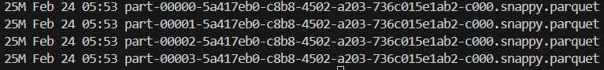

# Module 5 Homework

In this homework we'll put what we learned about Spark in practice.

For this homework we will be using the Yellow 2024-10 data from the official website: 

```bash
wget https://d37ci6vzurychx.cloudfront.net/trip-data/yellow_tripdata_2024-10.parquet
```


## Question 1: Install Spark and PySpark

- Install Spark
- Run PySpark
- Create a local spark session
- Execute spark.version.

What's the output?

> [!NOTE]
> To install PySpark follow this [guide](https://github.com/DataTalksClub/data-engineering-zoomcamp/blob/main/05-batch/setup/pyspark.md)

> Answer

```
3.3.2
```

## Question 2: Yellow October 2024

Read the October 2024 Yellow into a Spark Dataframe.

Repartition the Dataframe to 4 partitions and save it to parquet.

What is the average size of the Parquet (ending with .parquet extension) Files that were created (in MB)? Select the answer which most closely matches.

- 6MB
- 25MB
- 75MB
- 100MB

> Screenshot



> Answer

```
25MB
```

## Question 3: Count records 

How many taxi trips were there on the 15th of October?

Consider only trips that started on the 15th of October.

- 85,567
- 105,567
- 125,567
- 145,567

> Query

```sql
SELECT COUNT(1) 
FROM yellow_2024_10 
WHERE to_date(tpep_pickup_datetime) = '2024-10-15';
```

> Answer

```
125,567
```

## Question 4: Longest trip

What is the length of the longest trip in the dataset in hours?

- 122
- 142
- 162
- 182

> Query

```sql
SELECT MAX((CAST(tpep_dropoff_datetime AS LONG) - CAST(tpep_pickup_datetime AS LONG)) / 3600) AS duration
FROM yellow_2024_10;
```

> Answer

```
162
```

## Question 5: User Interface

Spark’s User Interface which shows the application's dashboard runs on which local port?

- 80
- 443
- 4040
- 8080

> Answer

```
4040
```

## Question 6: Least frequent pickup location zone

Load the zone lookup data into a temp view in Spark:

```bash
wget https://d37ci6vzurychx.cloudfront.net/misc/taxi_zone_lookup.csv
```

Using the zone lookup data and the Yellow October 2024 data, what is the name of the LEAST frequent pickup location Zone?

- Governor's Island/Ellis Island/Liberty Island
- Arden Heights
- Rikers Island
- Jamaica Bay

> Query

```sql
SELECT 
zones.Zone AS pickup_location_zone, 
COUNT(1)
FROM yellow_2024_10 yellow 
LEFT JOIN zones 
ON yellow.PULocationID = zones.LocationID
GROUP BY 1
ORDER BY 2 ASC;
```

> Answer

```
Governor's Island/Ellis Island/Liberty Island
```

## Submitting the solutions

- Form for submitting: https://courses.datatalks.club/de-zoomcamp-2025/homework/hw5
- Deadline: See the website
